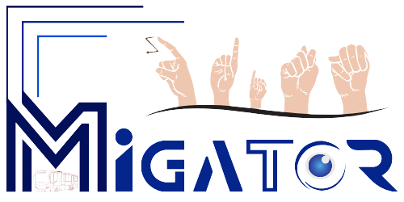
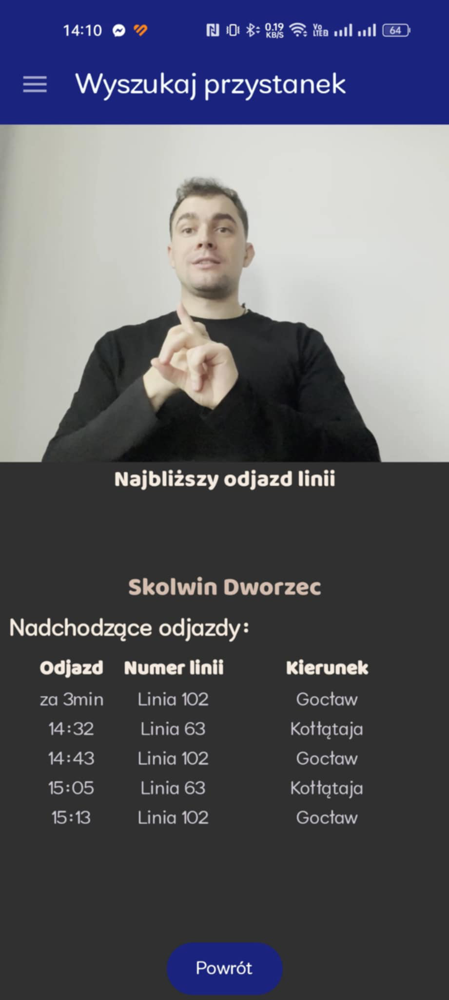
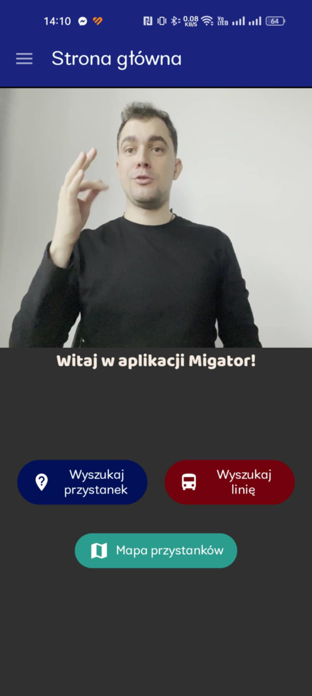
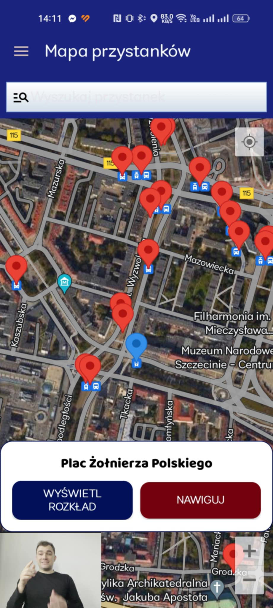

# 🚀 Migator: Twój Asystent Komunikacji Miejskiej



**Migator** to nowoczesna aplikacja mobilna zaprojektowana z myślą o osobach głuchoniemych, która czyni komunikację miejską bardziej dostępną i intuicyjną. Dzięki obsłudze języka polskiego i polskiego języka migowego umożliwia szybkie wyszukiwanie przystanków, autobusów oraz przeglądanie map z interaktywnymi komunikatami.

---

## 🔒 Kluczowe Funkcjonalności

- 🚌 **Wyszukiwanie przystanków**: znajdź najbliższe przystanki i sprawdź rozkład jazdy.
- 📝 **Informacje o liniach**: szczegółowe dane o trasach i godzinach odjazdów.
- 🔍 **Interaktywna mapa**: lokalizuj przystanki i linie na mapie z komunikatami wizualnymi.
- 🔇 **Wsparcie dla osób głuchoniemych**: dostosowanie do języka polskiego migowego (PJM).





---

## 🔎 Status Projektu

🔴 **Obecny etap:** Aplikacja obsługuje komunikację miejską w Szczecinie.  
🌐 **Plany:** Rozszerzenie na całą Polskę, rozwój nowych funkcji, w tym integracja z GPS i powiadomienia push.

---

## 💡 Technologie

| Warstwa      | Technologia         |
|--------------|---------------------|
| **Programowanie** | Android Studio, Java (docelowo Kotlin) |


---

## 🔄 Jak zainstalować?

### 1. Sklonuj repozytorium:
```bash
git clone https://github.com/Radzio310/Migator.git
```

### 2. Otwórz projekt w Android Studio:
   - Uruchom Android Studio.
   - Wybierz opcję "Otwórz projekt" i wskaż lokalizację repozytorium.

### 3. Uruchom projekt na emulatorze lub podłączonym urządzeniu:
   - Wybierz urządzenie docelowe.
   - Kliknij "Run" (Zielona strzałka) w Android Studio.

---

## 👪 Zespół

| Członek zespołu      | Rola                         |
|--------------------------|------------------------------|
| **Radosław Witkowicz** | Lider projektu, Frontend     |
| **Jakub Szczepański**   | Backend Developer           |
| **Dawid Mrówczyński**  | Backend Developer           |

---

## 🌐 Licencja

Projekt jest licencjonowany na podstawie licencji GPL 3.0. Szczegóły znajdują się w pliku [LICENSE](./LICENSE).

---

## 🔗 Kontakt

Jeśli masz pytania lub sugestie, skontaktuj się z nami poprzez otwarcie [issue](https://github.com/Radzio310/Migator/issues) w repozytorium.

---

# 🚀 Migator: Your Urban Mobility Assistant


**Migator** is a modern mobile app designed to make public transportation accessible and intuitive for deaf and mute individuals. Supporting Polish and Polish Sign Language, it enables quick stop searches, bus line information, and interactive map viewing with tailored messages.

---

## 🔒 Key Features

- 🚌 **Stop Search**: Find nearby stops and check schedules.
- 📝 **Bus Line Information**: Detailed data about routes and departure times.
- 🔍 **Interactive Map**: Locate stops and lines on a map with visual messages.
- 🔇 **Support for the Deaf and Mute**: Tailored content in Polish Sign Language (PJM).


---

## 🔎 Project Status

🔴 **Current Phase:** Supports public transportation in Szczecin.  
🌐 **Plans:** Expansion across Poland, integration with GPS, and push notifications.

---

## 💡 Technologies

| Layer         | Technology          |
|---------------|---------------------|
| **Programming** | Android Studio, Java (Kotlin planned) |


---

## 🔄 Installation Guide

### 1. Clone the repository:
```bash
git clone https://github.com/Radzio310/Migator.git
```

### 2. Open the project in Android Studio:
   - Launch Android Studio.
   - Select "Open Project" and navigate to the repository location.

### 3. Run the project on an emulator or connected device:
   - Choose a target device.
   - Click "Run" (Green arrow) in Android Studio.

---

## 👪 Team

| Team Member            | Role                         |
|------------------------|------------------------------|
| **Radosław Witkowicz** | Project Leader, Frontend    |
| **Jakub Szczepański**   | Backend Developer          |
| **Dawid Mrówczyński**  | Backend Developer          |

---

## 🌐 License

The project is licensed under the GPL 3.0 License. See [LICENSE](./LICENSE) for details.

---

## 🔗 Contact

If you have questions or suggestions, feel free to reach out by opening an [issue](https://github.com/Radzio310/Migator/issues) in the repository.


[Figma prototype](https://www.figma.com/design/wLCrypPvu61xB24ifdH7HY/Untitled?node-id=0-1&node-type=canvas&t=cXrW08M15WFF3Ssq-0)
